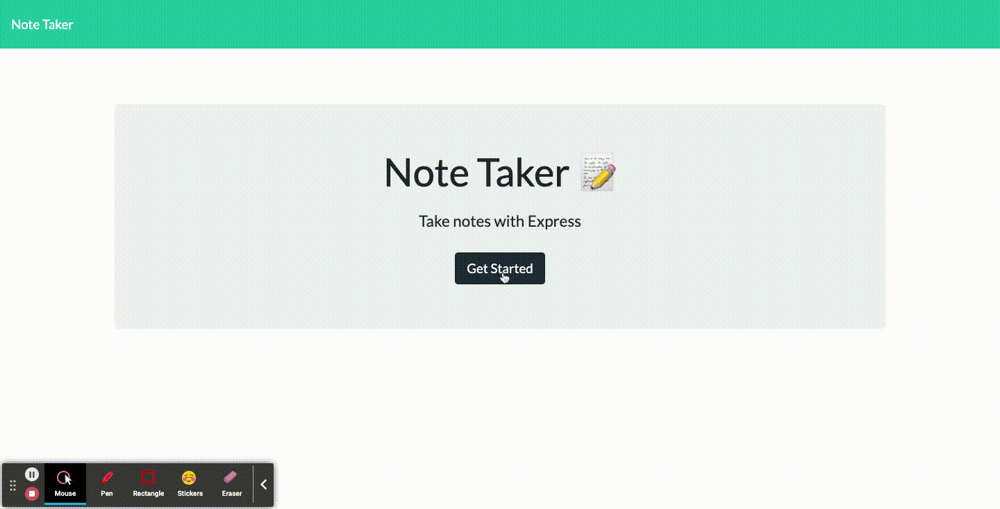

# Express.js Note Taker

## Description
This is an application that can be used to write and save notes and/or tasks, then retrieve the data from a JSON file using Express.js, hosted out from Heroku.

## Installation
Install `Node.js` - https://nodejs.org/en/download/package-manager/ 

`Express`, `UUID` and `Nodemon` were installed through `npm install`.

## Usage
The user can save new notes and/or tasks, retrieve them for review, or delete once the task has been completed.

## Languages
* HTML
* Javascript
* CSS
* Bootstrap - CSS framework

## Packages used
* Express
* UUID
* Nodemon

## Mock up

[Link to the deployed code in Heroku](https://sheltered-reaches-60594.herokuapp.com/)

